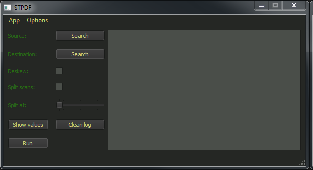
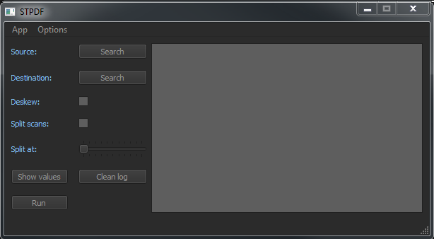
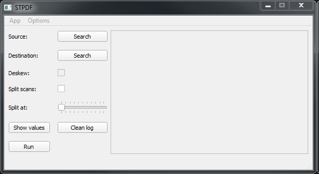
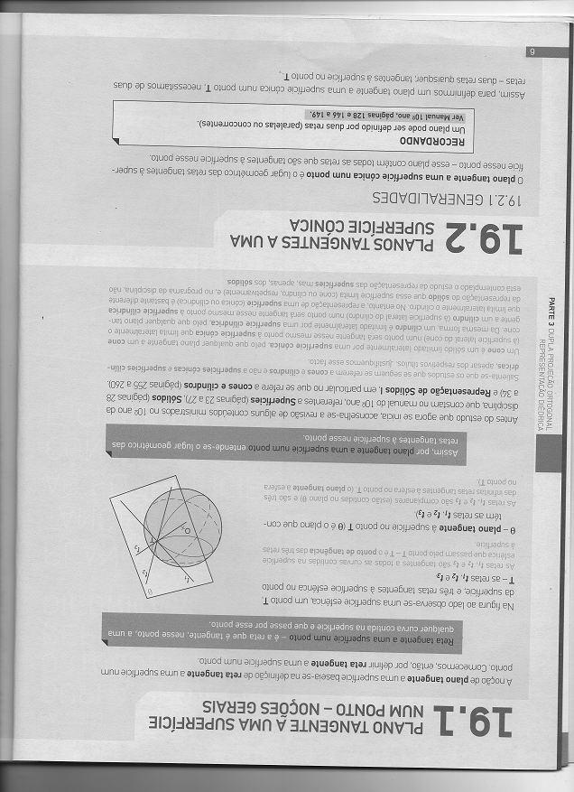
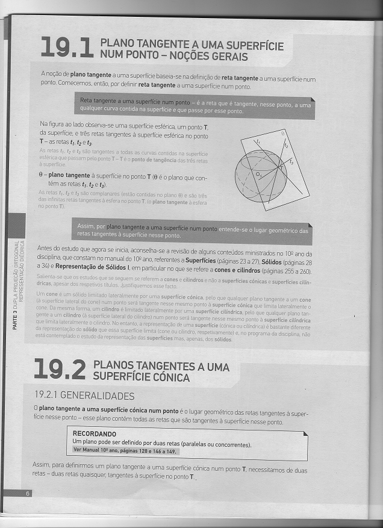

---
# Feel free to add content and custom Front Matter to this file.
# To modify the layout, see https://jekyllrb.com/docs/themes/#overriding-theme-defaults

layout: default
title: Home
permalink: /
nav_order: 1
---

# STPDF - ScanToPDF

ScanToPDF is an app that will allow you to easily make PDF's of image scans,
it supports a wide variety of feature like deskew image *(removes rotation), spliting into multiple
PDF's, custom themes and more ....

## Features

### Custom themes

You can easily create a theme to override the colors of the interface, the app comes with 3 default themes,
1. the "default" one is with everything default some colors might vary depending on your system
2. the "STPDF-dark.ini" is a simple dark theme
3. the "STPDF-cmder.ini" a theme inspired in [cmder](https://cmder.net/)

### Deskewing images

Altough ScanToPDF has the ability to deskew images it can't do it withouth [Tesseract](https://github.com/tesseract-ocr/tesseract),
and tesseract is not shipped with the app, if you are on linux you can just install it with your package manager
on windows you can find installers [here](https://github.com/UB-Mannheim/tesseract/wiki)

Tesseract will also need to be in the environment PATH variable, to check it is available just open up a command line and type tesseract,
if it displays info and it's arguments then it's working

### Localization

This app is currently available in 3 languages:
  * English
  * Portuguese
  * Spanish

if you would like to help with the translation please see [contributing](customization/contributing/)
